# KubeOps Linux CheatSheet

This is Day to Day Work Linux Cheatsheet for Software Engineers.

**Facebook:** [Link](https://facebook.com/kubeopsskills)

**Youtube:** [Link](https://www.youtube.com/c/kubeopsskills)

# Copyright

 This work is licensed under a <a rel="license" href="https://creativecommons.org/licenses/by-sa/4.0/">Creative Commons Attribution-ShareAlike 4.0 International License</a>.

## Directory Commands

| Name                            | Command                                           |
| ------------------------------- | ------------------------------------------------- |
| Change Directory                | cd /<directory_path>                              |
| Change Directory to Previous    | cd ..                                             |
| Create Directory                | mkdir <directory_name>                            |
| Create Directory with Parent    | mkdir -p <parent_directory_name>/<directory_name> |
| Remove Directory                | rm -r <directory_name>                            |
| Remove Directory without prompt | rm -rf <directory_name>                           |
| Remove empty Directory          | rmdir <directory_name>                            |
| Copy Directory                  | cp -r <directory_name> <destination_path>         |
| Move Directory                  | mv <directory_name> <destination_path>            |

## Search Commands

| Name                                                             | Command                                                                                                      |
| ---------------------------------------------------------------- | ------------------------------------------------------------------------------------------------------------ |
| Search files in a directory                                      | find <directory_name> -name <file_name_pattern>                                                              |
| Search files in a directory with case-insensitive                | find <directory_name> -iname <file_name_pattern>                                                             |
| Search files in a directory and execute command on it            | find <directory_name> -name <file_name_pattern> -exec `<command>`                                            |
| Search text in file                                              | grep `<text>` <file_name>                                                                                    |
| Search text in file with line numbers                            | grep -n `<text>` <file_name>                                                                                 |
| Search text in file with case-insensitive                        | grep -i `<text>` <file_name>                                                                                 |
| Search text in file for all patterns given                       | grep -e `<text>` <file_name>                                                                                 |
| Search multiple text with case-insensitive and all pattern given | grep -ie `<text1>` <file_name> -ie `<text2>` <file_name> -ie `<text3>` <file_name> -ie `<textn>` <file_name> |
| Search file for any lines that don't include the content         | grep -v '<content_pattern>' <file_name>                                                                      |

## Pipes

| Name                        | Command         |
| --------------------------- | --------------- |
| Send stdout of cmd1 to cmd2 | cmd1 `\|` cmd2  |
| Send stderr of cmd1 to cmd2 | cmd1 `\|&` cmd2 |

## File Commands

| Name                                                                 | Command                                                          |
| -------------------------------------------------------------------- | ---------------------------------------------------------------- |
| Show content of the file                                             | cat <file_name>                                                  |
| Create a file with content                                           | cat `<<EOF >` <file_name> #!/bin/bash `<content>` `EOF` |
| Create an empty file                                                 | touch <file_name>                                                |
| Remove file                                                          | rm <file_name>                                                   |
| Remove file without prompt                                           | rm -f <file_name>                                                |
| Copy file                                                            | cp <file_name> <destination_path>                                |
| Move file                                                            | mv <file_name> <destination_path>                                |
| Show first n lines of file                                           | head -n <n> <file_name>                                          |
| Show last n lines of file                                            | tail -n <n> <file_name>                                          |
| Keep showing last 10 lines of file                                   | tail -f <file_name>                                              |
| Show total line in a file                                            | cat <file_name> \| wc -l                                         |
| List files in current directory                                      | ls                                                               |
| List files, hidden files in current directory                        | ls -a                                                            |
| List files in current directory with their permissions and sizes     | ls -l                                                            |
| List files in current directory with their permissions, sizes, units | ls -lh                                                           |
| Paginate the content of file                                         | cat <file_name> `\|` less                                        |
| Create symbolic link to source file in current directory             | ln -s <file_name>                                                |
| Create symbolic link to source file in directory                     | ln -s <file_name> <directory>                                    |
| Extract .tar.gz file                                                 | tar -zxvf <file_name>                                            |
| See the differences between files                                    | diff <file_a> <file_b>                                           |

## File Permissions Commands

| Name                                               | Command                                |
| -------------------------------------------------- | -------------------------------------- |
| Change file permission with permission number      | chmod 755 <file_name>                  |
| Change directory permission with permission number | chmod -R 755 <directory_name>          |
| Change directory permission with letters           | chmod -R u+rw,g+r,o+x <directory_name> |
| Change file owner                                  | chown <user> <file_name>               |
| Change file owner with user's login group          | chown <user>: <file_name>              |
| Change directory and its content owner recursively | chown -R <user> <directory_name>       |

## File Permissions Numbers

| Name | Command     |
| ---- | ----------- |
| 4    | read (r)    |
| 2    | write (w)   |
| 1    | execute (x) |

## Process Commands

| Name                                                          | Command                                  |
| ------------------------------------------------------------- | ---------------------------------------- |
| Shows processes for the current shell                         | ps                                       |
| View all the running processes                                | ps -A or ps -e                           |
| View all processes associated with the terminal               | ps -a                                    |
| View all processes associated with the terminal and show user | ps -aux                                  |
| Kill specific process id                                      | kill -SIGTERM <process_id> ...           |
| Lists signal                                                  | kill -l                                  |
| Kill all processes with specifies name                        | pkill <process_name>                     |
| Kill all processes with case-insensitive                      | pkill -i <process_name>                  |
| Kill specific running command                                 | pkill -f <running_command_pattern>       |
| Kill all processes with specific signal                       | pkill --signal `<signal>` <process_name> |
| Show dynamic real-time processes list of specific user        | top -u `<user>`                          |

## Vi/Vim Command Shortcuts

To understand Vim well, we need to understand Vim editing modes. Vim has 6 basic modes which are:

| Name             | Description                                                              | Help page               |
| ---------------- | ------------------------------------------------------------------------ | ----------------------- |
| **normal**       | For navigation and manipulation of text. This is the default mode.       | :help Normal-mode       |
| **insert**       | For inserting new text.                                                  | :help Insert-mode       |
| **visual**       | For manipulation of text selection.                                      | :help Visual-mode       |
| select           | Similar to a visual mode, but with a more MS Windows-like behavior.      | :help Select-mode       |
| **command-line** | For entering editor commands - like the help commands (:help), quit (:q) | :help Command-line-mode |
| Ex-mode          | Similar to a command-line mode but optimized for batch processing.       | :help Ex-mode           |

| Name                                                                                   | Command                | Example                                               |
| -------------------------------------------------------------------------------------- | ---------------------- | ----------------------------------------------------- |
| Edit a file                                                                            | vi <file_name>         | 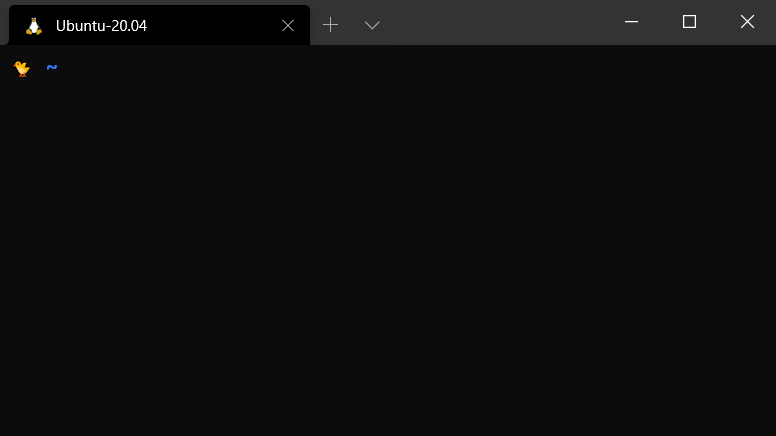               |
| Enter an insert mode to insert new text                                                | **i**                  | 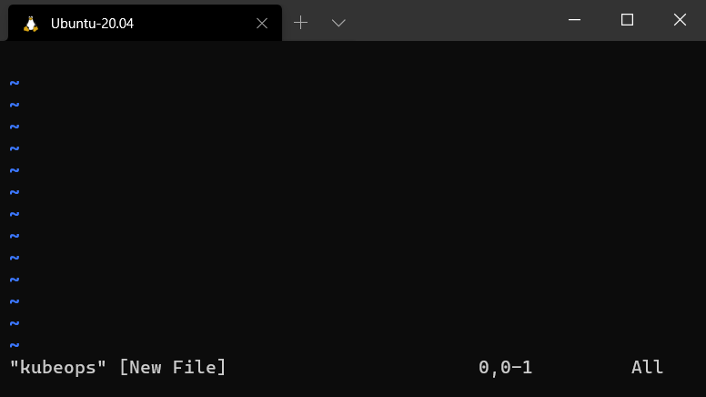                  |
| Insert a blank line under the current line and switch to an insert mode                | o                      | 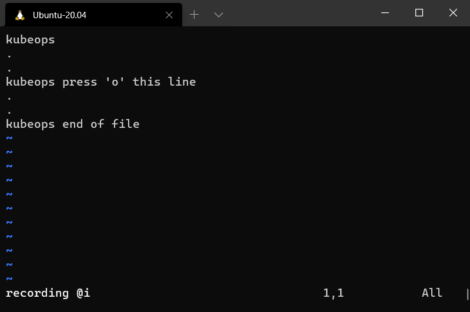        |
| Switch to an insert mode and move a cursor to the end of line (Append)                 | A                      | 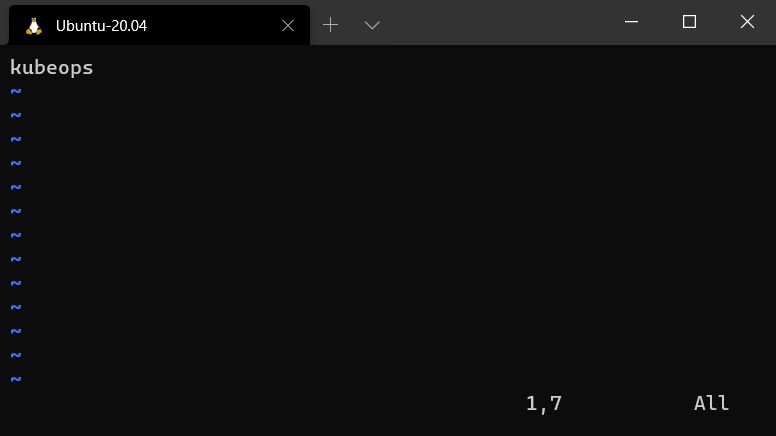                 |
| Copy the current line                                                                  | yy                     | 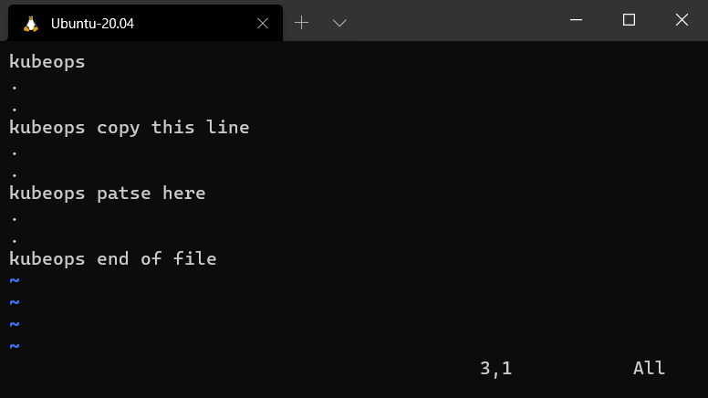          |
| Paste copied text after the current cursor position                                    | p                      |           |
| Delete the current line and switch to an insert mode (Change a line)                   | cc                     | 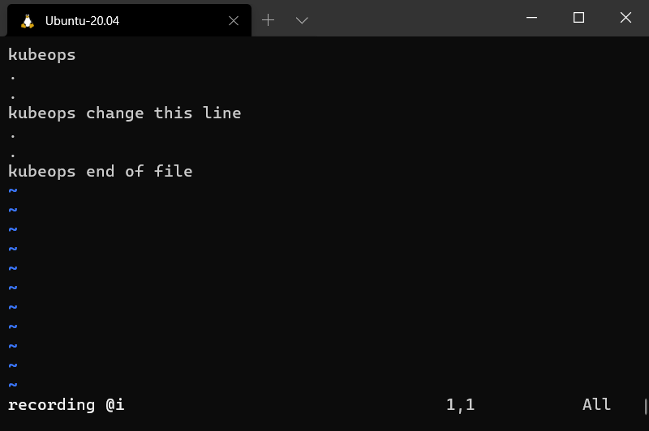             |
| Delete the current line and stay in an normal mode                                     | dd                     | 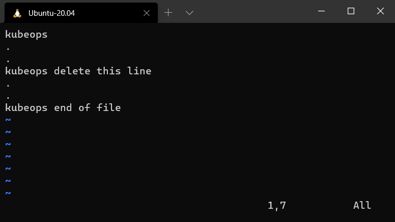             |
| Delete from the current cursor position to the end of a word                           | dw                     |         |
| Delete before the current cursor position to the beginning of a word                   | db                     | 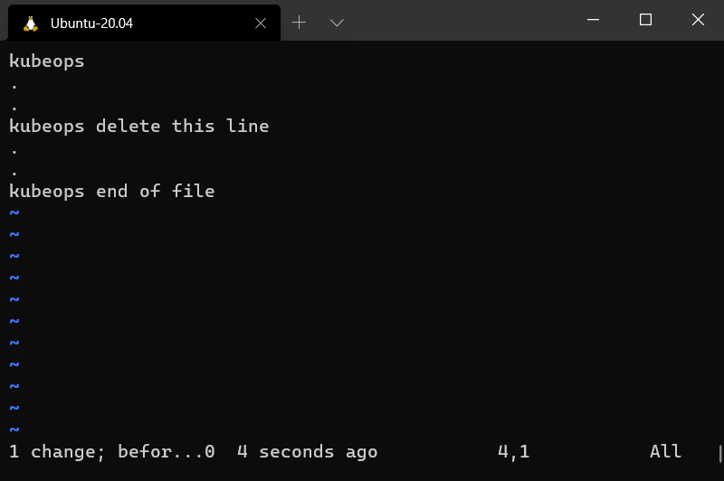    |
| Delete a character at the current cursor position and stay in a normal mode            | x                      |          |
| Delete and switch to an insert mode from the current cursor postion to the end of line | C                      |                  |
| Delete a character and switch to an insert mode (Substitute a character)               | s                      |     |
| Move the cursor left                                                                   | h                      | 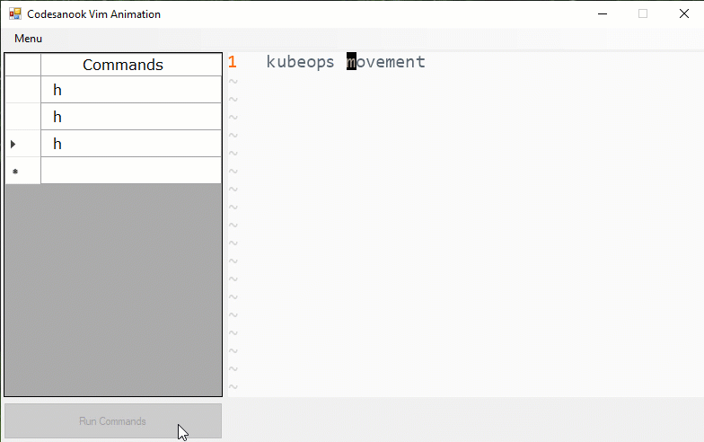    |
| Move the cursor down                                                                   | j                      | 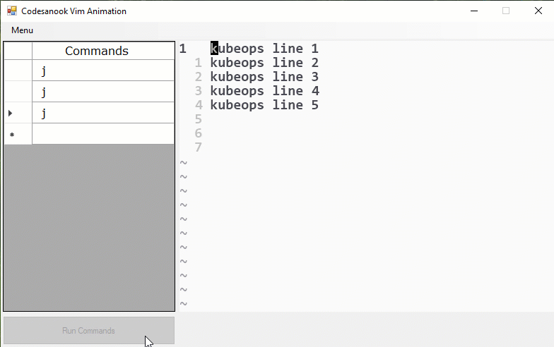    |
| Move the cursor up                                                                     | k                      | 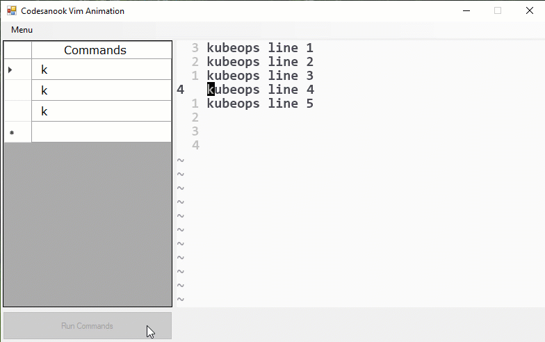      |
| Move the cursor right                                                                  | l                      | 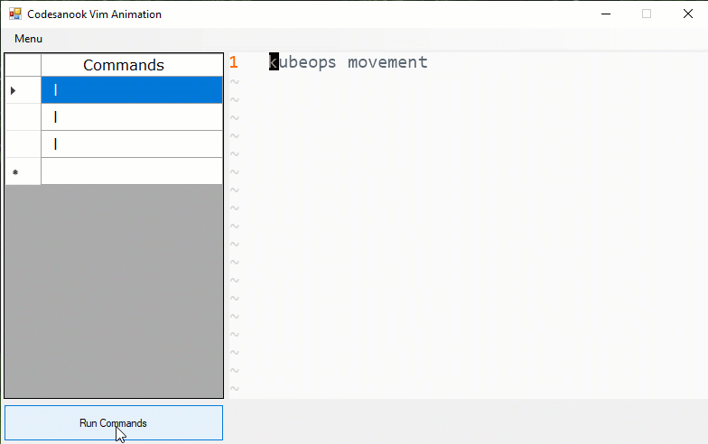   |
| Go to the begining of the first line                                                   | gg                     | 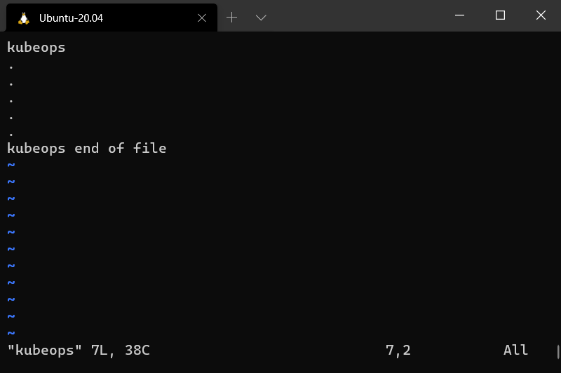               |
| Go to the begining of the last line                                                    | G                      |             |
| Go to a line number                                                                    | `<row_number>` + gg    |                |
| Go to a column number                                                                  | `<column_number>` + \  | 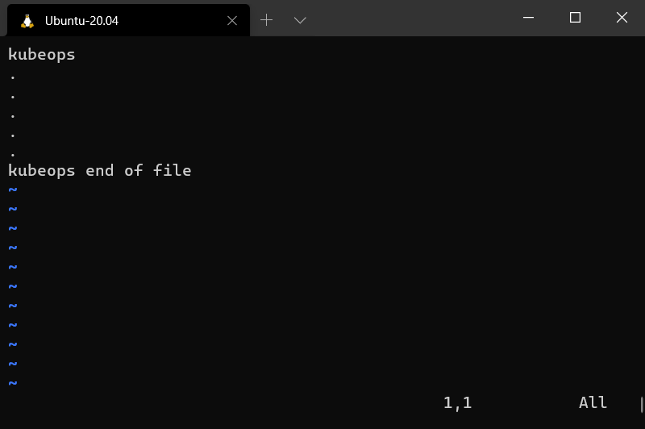            |
| Search keyword                                                                         | / `<keyword>`          | 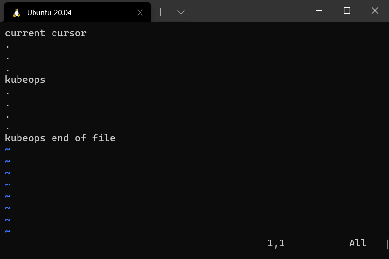          |
| Search keyword with case-insensitive                                                   | /`<keyword>`\c         |  |
| Move to the next found keyword after searching                                         | n                      | 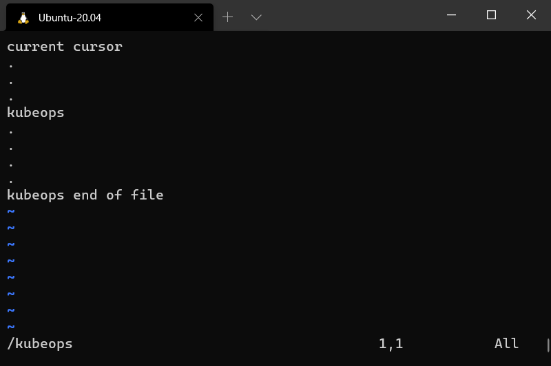             |
| Move to the previous found keyword after searching (invert of n)                       | N                      |          |
| Visual selection a character at the current cursor position                            | v                      | 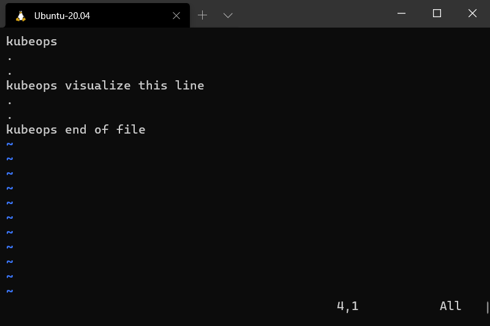     |
| Visual selection the current line                                                      | V                      | 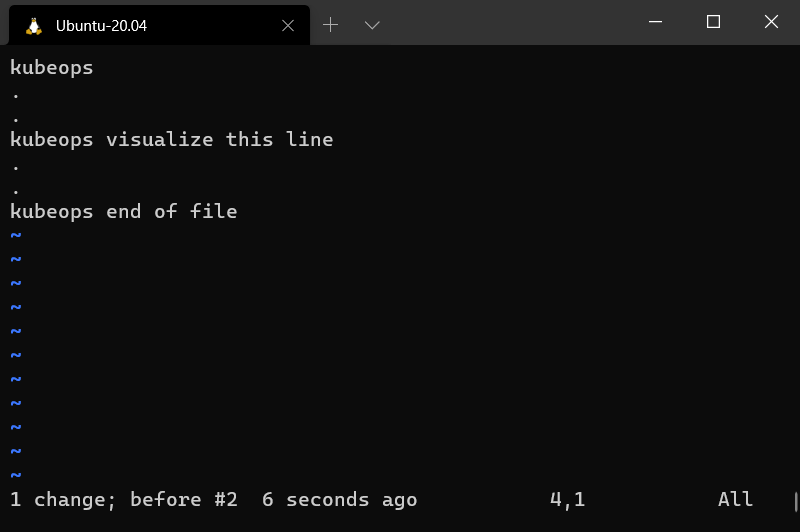          |
| Tab right                                                                              | shift + .              | 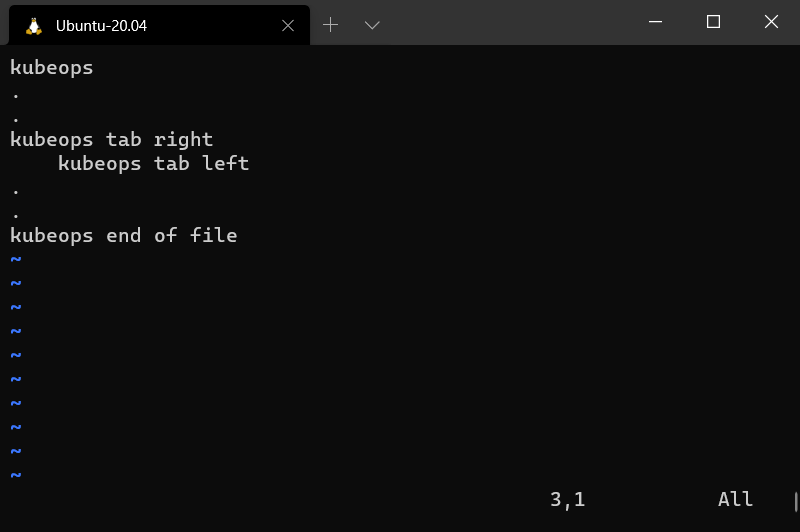               |
| Tab left                                                                               | shift + ,              | 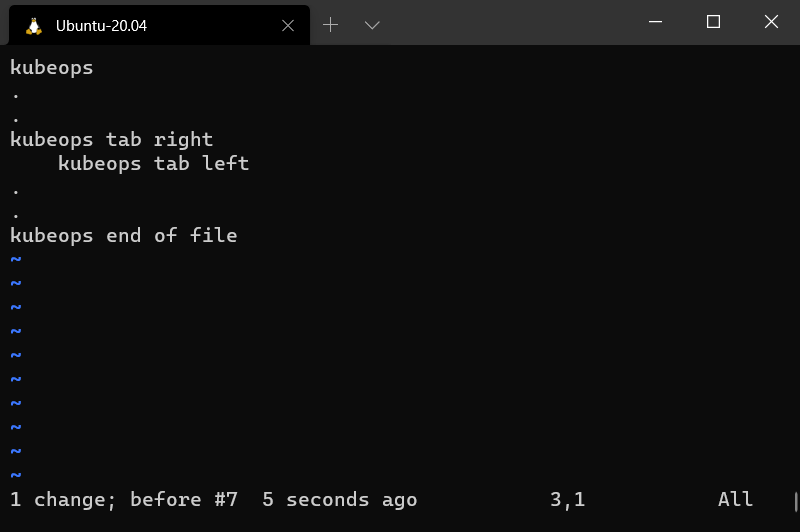                |
| Repeat a last change                                                                   | .                      | 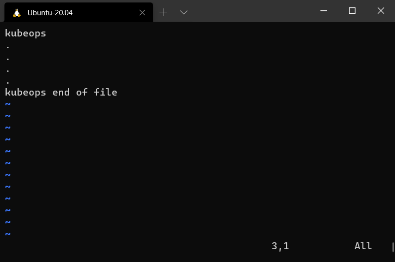      |
| Undo change                                                                            | u                      | 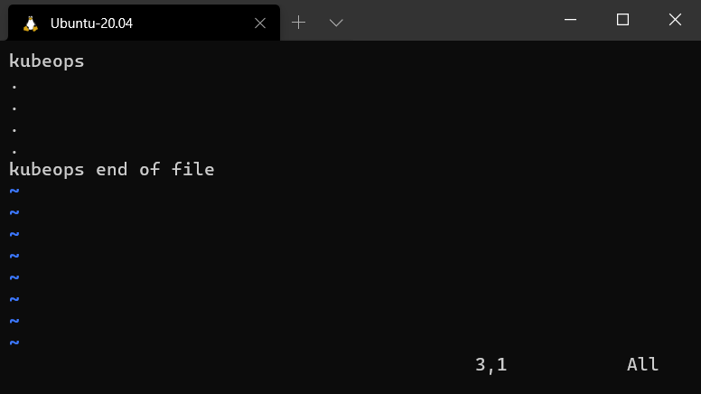                    |
| Redo change                                                                            | ctrl + r               | 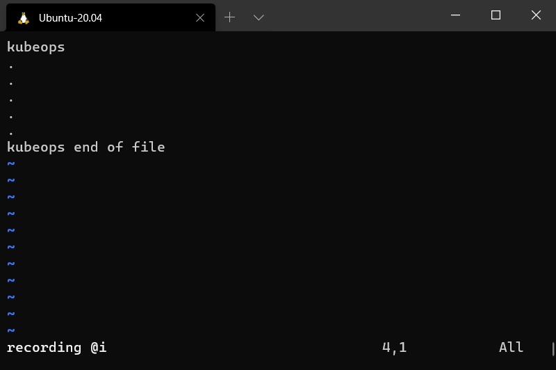                    |
| Save and quit                                                                          | **:wq**                | 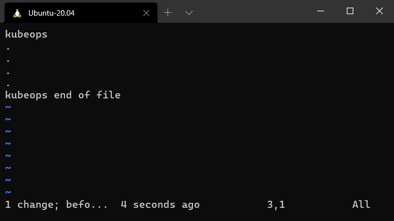                    |
| Quit (The most important Vi/Vim command)                                               | **:q**                 | 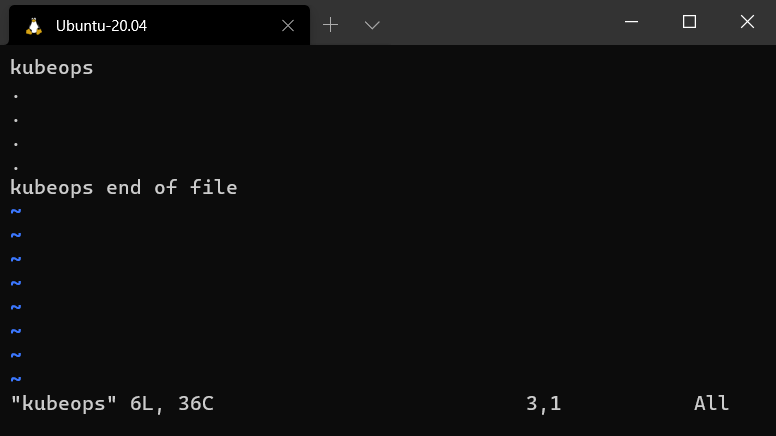                    |

## Bash Commands

| Name                     | Command         |
| ------------------------ | --------------- |
| Show System              | uname -a        |
| Show Mounted File System | mount           |
| Show System Date         | date            |
| Show Uptime              | uptime          |
| Show username            | whoami          |
| Show Manual Command      | man `<command>` |
| Show History Command     | history         |

## Bash Shortcuts

| Name                                                                          | Command     |
| ----------------------------------------------------------------------------- | ----------- |
| Stop Current Command                                                          | CTRL + c    |
| Sleep Program                                                                 | CTRL + z    |
| Search History                                                                | CTRL + r    |
| Repeat Last Command                                                           | !!          |
| Run the most recent command that matches with starting character(s) of string | !`<string>` |

## Bash Variables

| Name                        | Command                               |
| --------------------------- | ------------------------------------- |
| Show Environment Variables  | env                                   |
| Show Value of Variable      | echo \$`<VariableName>`               |
| Set Value of Variable       | export \$`<VariableName>` = `<value>` |
| Show Executable Search Path | \$PATH                                |
| Show Home Directory         | \$HOME                                |
| Show Current Shell          | \$SHELL                               |

## Multiple Commands

| Name                                       | Command                      |
| ------------------------------------------ | ---------------------------- |
| Run command1 then command2                 | `<command1> ; <command2>`    |
| Run command2 if command1 is successful     | `<command1> && <command2>`   |
| Run command2 if command1 is not successful | `<command1> \|\| <command2>` |

## Network Commands

| Name                                                         | Command          |
| ------------------------------------------------------------ | ---------------- |
| Display all network interfaces and IP addresses              | `ifconfig -a`    |
| Send echo requests to the target host to verify connectivity | `ping <host>`    |
| Get who is information for domain                            | `whois <domain>` |
| Get DNS information for domain                               | `dig <domain>`   |
| Reverse lookup host                                          | `dig -x <host>`  |
| Display name of server                                       | `hostname`       |
| Download file                                                | `wget <file>`    |
| Listing all listening connections ports                      | `netstat -a`     |

## References

**An A-Z Index of Linux command line:** [Link](https://ss64.com/bash/)
